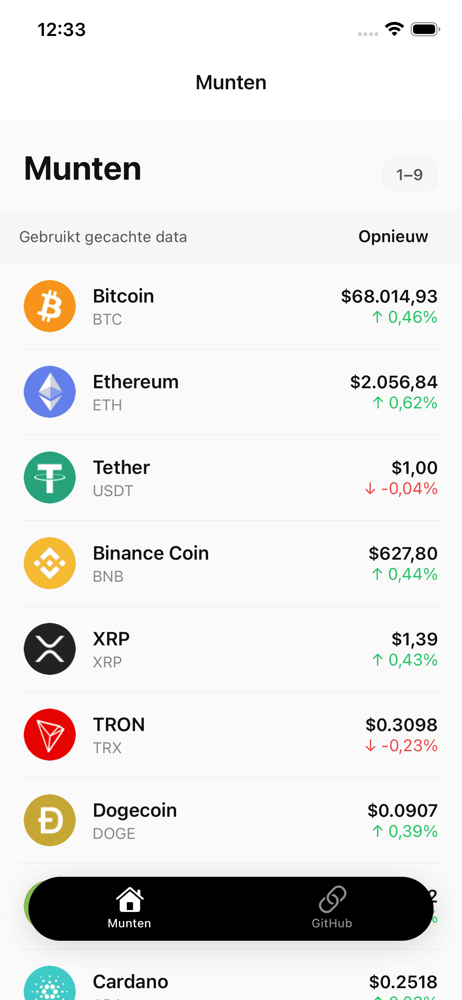
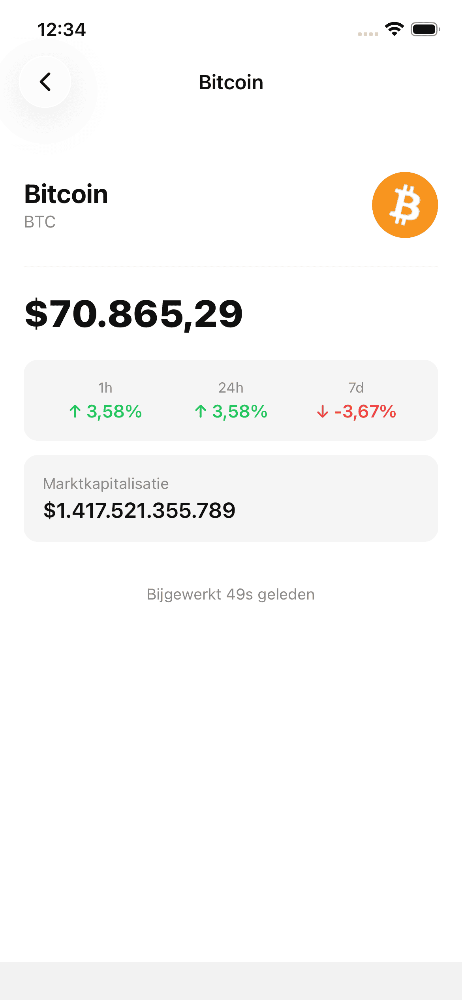
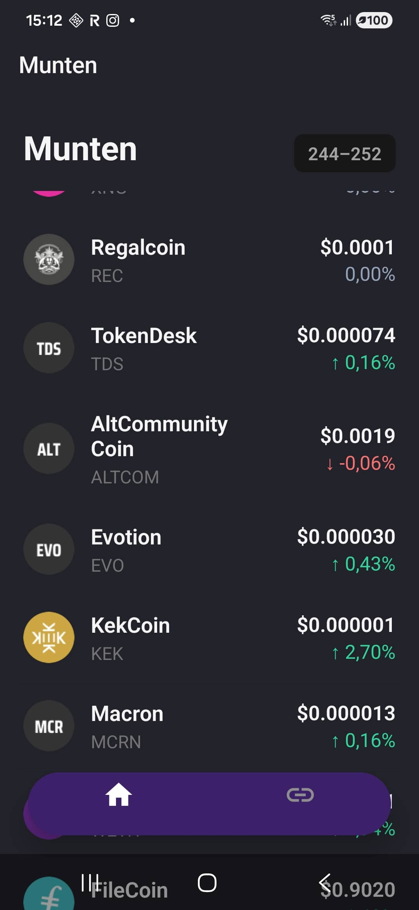
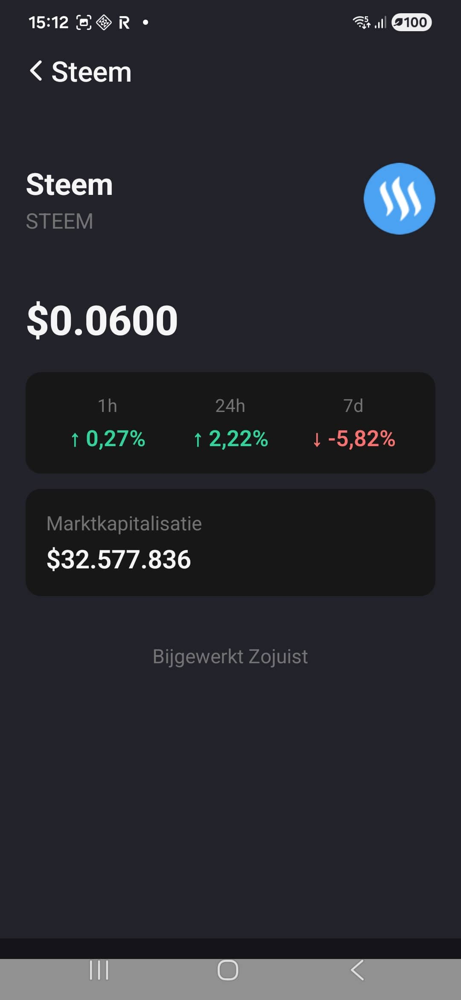
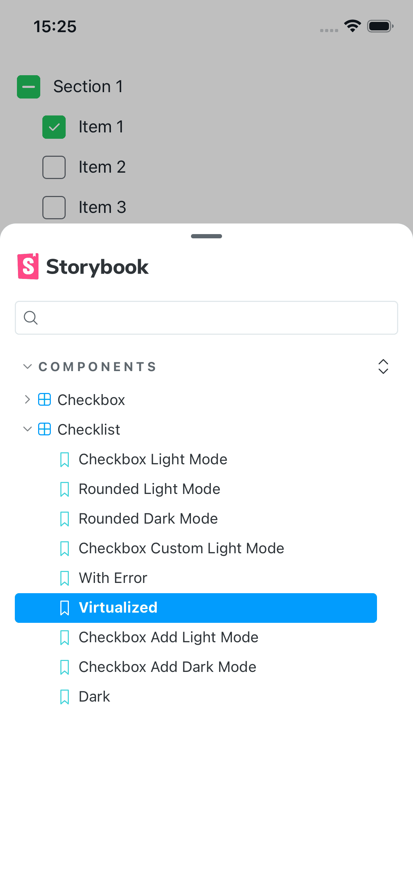
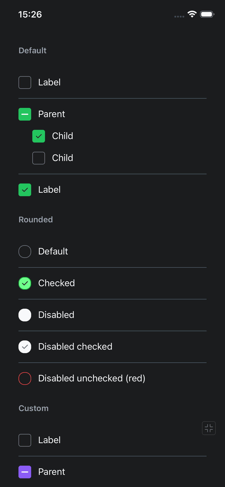

# React Coins Demo

Monorepo with two Expo apps:

- **Coins App** — Cryptocurrency browsing (list + detail, real-time prices)
- **UI Demo Checkbox** — Storybook for UI component development

**[Architecture & decisions →](ARCHITECTURE.md)**

---

## Coins App

React 19, Expo 55, TypeScript, TanStack Query. iOS, Android, Web.

<p>
  
  
  
  
</p>

### Get started

```bash
cd coins-app && npm install
```

Create `coins-app/.env` with:

```
EXPO_PUBLIC_API_URL=https://your-api.example.com
```

Then:

```bash
cd coins-app
npm start        # or: npm run ios | android | web
```

### API

| Method | Path | Description |
|--------|------|-------------|
| GET | `/coins?page[number]=1&page[size]=50` | Paginated list |
| GET | `/coins/:id` | Single coin |

### Scripts

| Script | Description |
|--------|-------------|
| `npm start` | Expo dev server |
| `npm run web` | Web browser |
| `npm run lint` | ESLint |
| `npm test` | Jest unit tests |
| `npm run e2e` | Cypress E2E (web build must be running) |
| `npm run e2e:open` | Cypress UI |

### Device / Emulator

**iOS — device**

```bash
open coins-app/ios/coinsapp.xcworkspace
npx expo run:ios --device
# or with dev server:
npx expo start --ios
```

**iOS — emulator**

```bash
cd coins-app
npx expo run:ios
```

**Android — device**

```bash
cd coins-app
npm run android    # with device connected via USB
```

### Testing

Unit: Jest + React Native Testing Library. E2E: Cypress — tests run against the web build.

**Run tests**

```bash
cd coins-app && npm run web
# in another terminal:
cd coins-app && npm run e2e
```

### CI

GitHub Actions on push/PR: `npm ci --legacy-peer-deps`, lint, unit tests. See [.github/workflows/ci.yml](.github/workflows/ci.yml).

---

## UI Demo Checkbox

Expo app for developing UI components with Storybook.

<p>
  
  
</p>

```bash
cd ui-demo-checkbox && npm install
npx expo start
```

### Storybook

From `ui-demo-checkbox` directory:

```bash
npm run storybook
```

Other commands: `npm run storybook:ios`, `storybook:android`, `storybook:generate`
